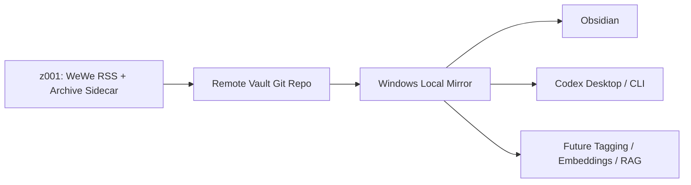

# 长期架构

## 目标

保持 `z001` 作为生产源，同时让 Windows 拥有稳定、可本地消费的知识库镜像。

## 推荐形态

## 职责划分

### z001

- 生产抓取
- 正文兜底
- 主库写入
- Git 提交与推送

### Windows

- 本地镜像
- 知识库浏览
- AI 读取
- 后续本地实验

## 为什么这样分

- Linux 生产链路更稳定
- Windows 更适合作为消费端和 AI 工具端
- 单一生产源可以减少状态分裂
- 以后做 embeddings / RAG 时，不需要重做抓取层

## 不要做的事

- 不要把 Windows 变成生产数据库
- 不要把手工拷贝目录当唯一同步手段
- 不要继续依赖 `Feeds\` 作为正文主库

## 后续扩展原则

- 标签化、清洗增强、AI-clean 派生层都建立在 `WeWe-RSS-AI` 之上
- embeddings / RAG 优先基于本地镜像实验，不反向耦合生产抓取链路
